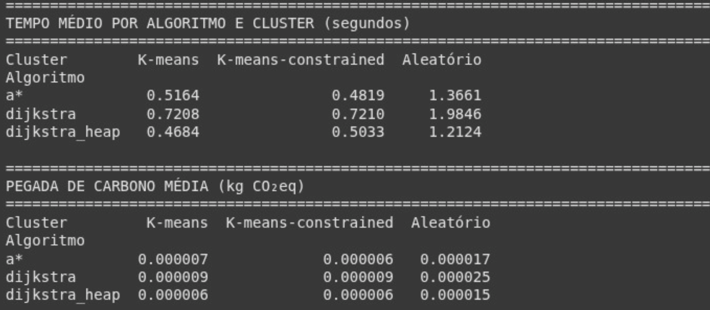

  

<h3 align="center"><strong>UNIVERSIDADE FEDERAL DO RIO GRANDE DO NORTE</strong></h3>

 
DEPARTAMENTO DE ENGENHARIA DE COMPUTAÇÃO E AUTOMAÇÃO 
  
DCA3702 - ALGORITMOS E ESTRUTURAS DE DADOS II  

<h1 align="center"><strong>PROJETO 05 - EXPLORANDO O ALGORITMO A*</strong></h1>

<strong>DISCENTES:</strong>
- IAN ANTONIO FONSECA ARAÚJO 
- LUCAS GARCIA COSTA 
- MINNAEL CAMPELO DE OLIVEIRA  

<strong>DOCENTE:</strong> 
- IVANOVITCH MEDEIROS DANTAS DA SILVA 

**Natal/RN — 2025**

## <strong>1. PROBLEMÁTICA</strong>

No dia a dia do Centro de Controle de Zoonoses de Natal, 10 agentes precisam sair de uma estação central, visitar um conjunto de casas espalhadas pela cidade e retornar ao ponto de partida. No total, são 65 locais de visita divididos em quatro zonas da cidade, e todos devem ser atendidos. O desafio está em montar rotas inteligentes para cada agente: que cubram todos os pontos, evitem caminhos desnecessários, reduzam o tempo total gasto e, de quebra, ajudem a economizar combustível e reduzir emissões de CO₂. Para isso, vamos aplicar algoritmos de busca de caminhos como A*, Dijkstra e Dijkstra com min-heap, utilizando mapas reais da cidade com bibliotecas como networkx e osmnx. O objetivo é comparar essas estratégias com uma abordagem aleatória e verificar qual entrega o melhor resultado, considerando:

- Tempo de execução
- Distância percorrida
- Impacto ambiental

Com isso, buscamos uma solução prática, eficiente e aplicável a situações reais de logística urbana, onde o planejamento de rotas pode fazer toda a diferença na produtividade e no uso consciente de recursos.

## <strong>2. DESENVOLVIMENTO</strong>

#### 2.1 MODELAGEM E ANÁLISE INICIAL
O desenvolvimento da solução teve início com a obtenção do grafo de ruas da cidade de Natal/RN, utilizando a biblioteca OSMnx, que fornece representações de redes viárias com base em dados do OpenStreetMap. A partir desse grafo, foi identificado o nó mais próximo da estação central, definido pelas coordenadas geográficas (-5.75326, -35.26269).
Em seguida, foi realizada a leitura de um conjunto de 65 pontos de coleta a partir de um arquivo CSV, contendo suas respectivas latitudes e longitudes. Esses pontos representam as residências ou locais que precisam ser visitados pelos colaboradores. Para organizar a distribuição dos pontos entre os 10 colaboradores, foi empregada a técnica de clusterização, permitindo dividir os pontos de coleta em grupos distintos. Três abordagens foram utilizadas:

- K-Means Tradicional
Foi aplicado o algoritmo K-Means, com o número de clusters definido como 10. Essa abordagem distribui os pontos com base em similaridade espacial, sem restrição quanto ao número de elementos por grupo.

- K-Means Constrained
Utilizou-se o algoritmo KMeansConstrained, que permite impor restrições de tamanho mínimo e máximo para os clusters. Cada grupo recebeu entre 6 e 7 pontos, o que garante uma distribuição mais uniforme entre os colaboradores.

- Distribuição Aleatória
Uma abordagem não supervisionada foi implementada como base comparativa, onde os pontos foram atribuídos aleatoriamente aos grupos. Essa estratégia serve de benchmark para as demais técnicas otimizadas.

Cada cluster gerado representa a rota potencial de um colaborador. Para visualização, os grupos foram plotados sobre o grafo da cidade com a função plot_clusters(), destacando cada conjunto de pontos com uma cor diferente e indicando a estação central como ponto de partida comum. 

  
  
  

Sendo assim, será apresentado o desenvolvimento relacionado as implementações dos algoritmos de roteamento interno para cada cluster. A ideia é, para cada grupo de pontos:

- Calcular a menor rota possível partindo e retornando à estação central;
- Utilizar algoritmos de caminho mínimo: Dijkstra, Dijkstra com Min-Heap e A*;
- Armazenar as métricas de tempo de execução, distância percorrida e estimativa de emissão de CO₂.

Esses algoritmos serão aplicados sobre o grafo G previamente carregado, garantindo que a otimização ocorra respeitando a malha urbana real da cidade. O código atual está estruturado de forma modular, com funções reutilizáveis para a criação de clusters e visualização, o que permitirá integração eficiente com as rotinas de roteamento.

#### 2.2 ROTAS E CLUSTERS NO GRAFO A*

  
  
  

#### 2.4 ROTAS E CLUSTERS NO DIJKSTRA HEAP

  
  
  

## <strong>3. RESULTADOS</strong>

  

## <strong>4. CONCLUSÃO</strong>
O presente trabalho apresentou uma solução eficiente para o roteamento dos colaboradores do Centro de Controle de Zoonoses de Natal/RN, com base em 65 pontos de coleta distribuídos por toda a cidade. A estratégia adotada envolveu a clusterização dos pontos em 10 grupos, utilizando os métodos K-Means, K-Means Constrained e uma abordagem aleatória como base comparativa. A aplicação da clusterização com restrições demonstrou melhor equilíbrio na distribuição dos pontos entre os colaboradores. Em seguida, os algoritmos Dijkstra, Dijkstra com Min-Heap e A* foram utilizados para calcular rotas otimizadas dentro de cada cluster, sempre partindo e retornando à estação central, sobre o grafo viário real obtido com OSMnx. As métricas de distância, tempo de execução e estimativa de CO₂ permitiram comparar as abordagens, revelando que os métodos otimizados superam significativamente a distribuição aleatória em termos de eficiência operacional. Concluímos que a combinação de clusterização balanceada e algoritmos de caminho mínimo oferece uma solução prática, escalável e aplicável a diversos cenários de logística urbana.

## Vídeo Explicativo

[Link para o vídeo no YouTube ou Loom](https://www.loom.com/share/d6ec834f063f4d9d91a7b602b8e081ec?sid=f764c613-6d1f-4c41-a4a6-67ba525049a4)
