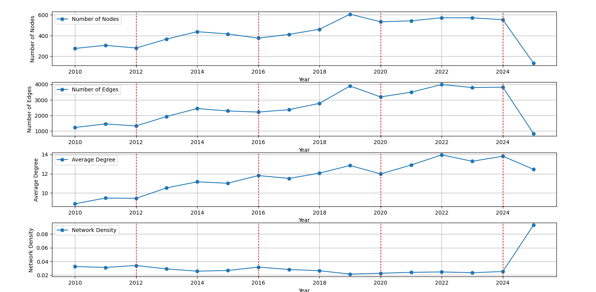
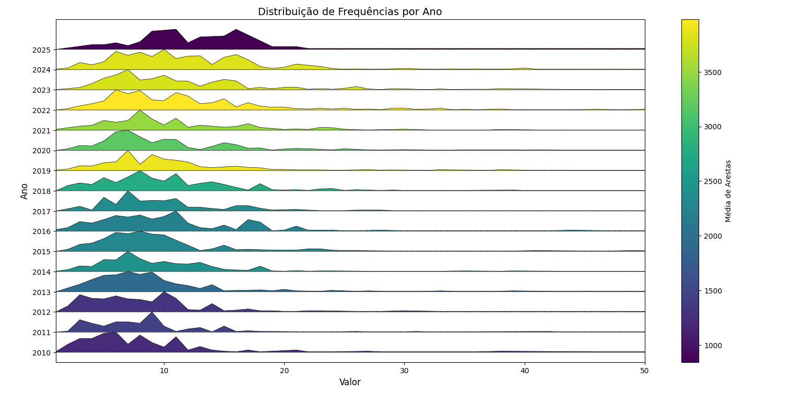



  

 

<strong>UNIVERSIDADE FEDERAL DO RIO GRANDE DO NORTE</strong>

 
DEPARTAMENTO DE ENGENHARIA DE COMPUTAÇÃO E AUTOMAÇÃO  
DCA3702 - ALGORITMOS E ESTRUTURAS DE DADOS II

<h2 align="center"><strong>PROJETO 01</strong></h2>

DISCENTES: IAN ANTONIO FONSECA ARAÚJO, MINNAEL CAMPELO DE OLIVEIRA

DOCENTE: IVANOVITCH MEDEIROS DANTAS DA SILVA

NATAL/RN 2025  

---

### **1. PROBLEMÁTICA**

A colaboração científica é reconhecida como motor essencial para o avanço do conhecimento, mas seus padrões e dinâmicas ao longo do tempo ainda carecem de investigação detalhada. No Programa de Pós‑Graduação em Engenharia Elétrica e Computação (PPgEEC), dispomos de dados de coautoria que vão de 2010 a 2025, organizados em redes anuais e em janelas temporais (triênios, quadrênios e o período completo). Surge então um conjunto de desafios:

1. **Evolução temporal**  
   Como variam, ano a ano, métricas fundamentais como densidade, número de autores, número de colaborações, grau médio e distribuição de grau? Quais tendências emergem e que marcos (2012, 2016, 2020, 2024) podem indicar mudanças estruturais no programa?

2. **Análise por janelas de avaliação**  
   Em que medida as redes triênais (2010–2012) e quadrienais (2013–2016, 2017–2020, 2021–2024) revelam perfis distintos de cooperação? Como identificar e destacar os 5 autores mais conectados em cada período, diferenciando conexões entre membros permanentes e eventuais e ponderando-as pelo número de citações?

3. **Subgrafo de alta conectividade**  
   Qual limiar de grau (X) seleciona um núcleo de autores altamente colaborativos na rede geral (2010–2025)? Como a densidade desse subgrafo se compara à da rede completa e que padrões de ego‑rede podem ser extraídos de um autor representativo?

Para responder a essas questões, utilizaremos a biblioteca NetworkX em Python para computar métricas, gerar visualizações (curvas temporais, histogramas/densidades, ridgeline charts, grafos destacados) e conduzir uma interpretação crítica dos resultados, levantando hipóteses sobre os mecanismos de formação e evolução das colaborações no PPgEEC.

### **2. DESENVOLVIMENTO**

#### **2.1 REQUISITO 1**

Esta seção documenta a análise evolutiva da rede de 2010 a 2025, utilizando métricas fundamentais que evidenciam a dinâmica estrutural e comportamental do grafo. A seguir, são apresentados os gráficos (imagens) gerados para intervalos temporais distintos, acompanhados das explicações e principais achados decorrentes da análise.

---

#### 2.1.1 Contextualização e Objetivos

O objetivo da análise foi examinar a evolução da rede empregando as seguintes métricas:
- **Densidade da rede:** Relação entre o número de arestas efetivas e o número máximo de conexões possíveis.
- **Número de vértices:** Total de nós presentes na rede em cada período.
- **Número de arestas:** Quantidade total de conexões que interligam os vértices.
- **Número médio de vizinhos:** Média de conexões por vértice, indicando a centralidade ou a dispersão das ligações.
- **Distribuição do número de vizinhos:** Histogramas que revelam como os graus dos vértices estão distribuídos – um indicativo da formação de hubs ou nós altamente conectados.

O estudo buscou identificar tendências como o crescimento da rede, a diminuição da densidade em razão do aumento de nós, e a emergência de uma distribuição de grau com cauda longa (característica de redes que adotam o mecanismo de *preferential attachment*).

---

#### 2.1.2 Metodologia

1. **Coleta de Dados:**  
   Foram extraídos snapshots da rede para cada ano do intervalo de 2010 a 2025.

2. **Cálculo das Métricas:**  
   Para cada snapshot foram calculadas as métricas descritas, possibilitando a avaliação do comportamento evolutivo da rede.

3. **Visualizações:**  
   Os resultados foram organizados graficamente em quatro blocos de imagens, correspondentes a intervalos temporais específicos, além de um painel consolidado com as métricas agregadas.

---

#### 2.1.3 Exibição das Imagens e Explicações

##### **Imagem 1: 2010–2013**

*Explicação:*  
Nesta fase inicial, os gráficos demonstram os primeiros estágios de consolidação da rede. Com um número reduzido de vértices, a densidade apresenta valores relativamente altos e a distribuição do número de vizinhos mostra-se ainda homogênea, com indícios preliminares do surgimento de hubs. Essa fase é crucial para estabelecer as bases da rede e definir os padrões de conexão que serão expandidos nos anos seguintes.

---

##### **Imagem 2: 2014–2017**

*Explicação:*  
No intervalo de 2014 a 2017, observa-se um crescimento acentuado no número de vértices e arestas. Apesar do aumento absoluto das conexões, a densidade vem caindo gradualmente, indicando que o crescimento dos nós supera o ritmo de formação de novas ligações. A distribuição do número de vizinhos começa a apresentar uma cauda longa, sinalizando a emergência dos primeiros hubs que se destacam na rede.

---

##### **Imagem 3: 2018–2021**

*Explicação:*  
Durante o período de 2018 a 2021, a rede atinge uma fase de maturação. Os gráficos evidenciam a consolidação dos padrões de conectividade: enquanto o número de vértices e arestas continua crescendo, a densidade segue em declínio. A distribuição do número de vizinhos se acentua, reforçando a presença de hubs (nós com alto grau de conectividade) e demonstrando uma clara divisão entre nós com pouca e alta conexão.

---

##### **Imagem 4: 2022–2025**

*Explicação:*  
No estágio mais recente (2022–2025), a rede mostra um novo patamar de expansão. Embora o número de vértices e arestas continue aumentando, a densidade permanece baixa, indicando que a formação de novos nós não é acompanhada por um crescimento proporcional nas conexões. A distribuição do número de vizinhos evidencia uma consolidação ainda maior dos hubs, com a maioria dos nós apresentando conectividade modesta enquanto poucos concentraram um número elevado de ligações.

---

##### **Imagem Consolidada: Métricas Agregadas**

*Explicação:*  
Esta imagem agrega as métricas calculadas ao longo de todo o período (2010–2025), permitindo uma análise comparativa integrada. É possível visualizar a relação inversa entre o crescimento do número de vértices e a densidade da rede, bem como a evolução do número médio de vizinhos e a formação acentuada dos hubs. Essa visão global reforça os achados de que, com o aumento dos nós, as ligações se diluem em termos relativos, mesmo com o aumento absoluto das conexões.

---

##### **Distribuição de Frequências por Ano**

*Explicação:*
Distribuição de Frequências por Ano
A imagem a seguir representa a distribuição de frequências de um determinado valor ao longo dos anos, indo de 2010 até 2025. Cada linha horizontal corresponde a um ano, com a distribuição dos valores desenhada como uma curva de densidade empilhada (também chamada de gráfico ridge ou joyplot). A coloração das curvas segue um gradiente baseado na média de arestas daquele ano, conforme a escala de cores à direita.

Essa visualização facilita a identificação de padrões e tendências temporais, como por exemplo:

- A concentração de valores mais baixos entre os anos de 2010 a 2013.

- Uma distribuição mais dispersa nos anos mais recentes, especialmente de 2020 em diante.

- A presença de médias de arestas mais elevadas em anos como 2019, 2023 e 2024, evidenciada pelas cores mais próximas do amarelo na escala viridis.

Essa abordagem é útil para analisar a evolução do comportamento dos dados ao longo do tempo, destacando anos com maior variação ou densidade em determinados intervalos de valores.

---

#### 2.1.4 Principais Achados e Dificuldades

- **Crescimento e Expansão:**  
  A rede apresentou um aumento contínuo no número de vértices e arestas ao longo dos anos, demonstrando uma expansão significativa.

- **Redução da Densidade:**  
  Mesmo com a multiplicação das conexões, a densidade diminuiu à medida que o crescimento dos nós ultrapassou o ritmo das novas conexões, caracterizando uma rede mais esparsa.

- **Formação de Hubs:**  
  A análise das distribuições de grau revelou a emergência de hubs, que se tornam pontos centrais na rede e evidenciam um padrão de cauda longa típico do mecanismo de *preferential attachment*.

- **Dificuldades:**  
  - Variações significativas nos dados anuais dificultaram a identificação de tendências sem um tratamento estatístico refinado.
  - A integração e comparação das métricas entre os diferentes períodos exigiram cuidados para garantir que os efeitos do crescimento em escala fossem corretamente interpretados.

---

#### 2.1.5 Conclusão

A análise evolutiva da rede permitiu compreender os mecanismos de crescimento e consolidação que influenciam sua estrutura. Observou-se que, embora o número absoluto de conexões cresça, a densidade diminui devido à expansão desproporcional dos vértices. A formação de hubs e a consolidação dos padrões de conexão oferecem insights valiosos sobre a resiliência e a dinâmica interna da rede, possibilitando a elaboração de hipóteses para investigações futuras.

#### **2.2 REQUISITO 2**

#### **2.3 REQUISITO 3**

### **3. CONCLUSÃO**

