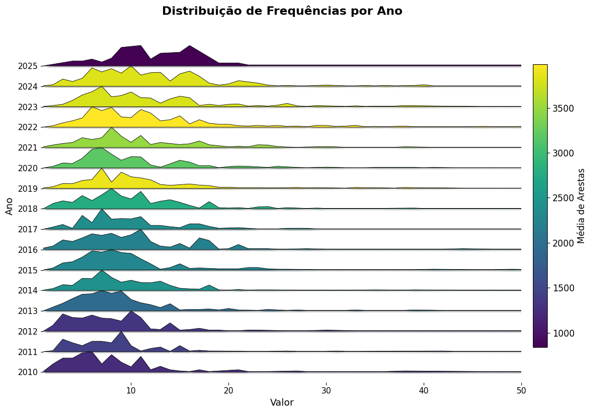

  

 

<strong>UNIVERSIDADE FEDERAL DO RIO GRANDE DO NORTE</strong>

 
DEPARTAMENTO DE ENGENHARIA DE COMPUTAÇÃO E AUTOMAÇÃO  
DCA3702 - ALGORITMOS E ESTRUTURAS DE DADOS II

<h2 align="center"><strong>PROJETO 01</strong></h2>

DISCENTES: IAN ANTONIO FONSECA ARAÚJO, MINNAEL CAMPELO DE OLIVEIRA

DOCENTE: IVANOVITCH MEDEIROS DANTAS DA SILVA

NATAL/RN 2025  

## **1. PROBLEMÁTICA**

A colaboração científica é reconhecida como motor essencial para o avanço do conhecimento, mas seus padrões e dinâmicas ao longo do tempo ainda carecem de investigação detalhada. No Programa de Pós‑Graduação em Engenharia Elétrica e Computação (PPgEEC), dispomos de dados de coautoria que vão de 2010 a 2025, organizados em redes anuais e em janelas temporais (triênios, quadrênios e o período completo). Surge então um conjunto de desafios:

1. **Evolução temporal**  
   Como variam, ano a ano, métricas fundamentais como densidade, número de autores, número de colaborações, grau médio e distribuição de grau? Quais tendências emergem e que marcos (2012, 2016, 2020, 2024) podem indicar mudanças estruturais no programa?

2. **Análise por janelas de avaliação**  
   Em que medida as redes triênais (2010–2012) e quadrienais (2013–2016, 2017–2020, 2021–2024) revelam perfis distintos de cooperação? Como identificar e destacar os 5 autores mais conectados em cada período, diferenciando conexões entre membros permanentes e eventuais e ponderando-as pelo número de citações?

3. **Subgrafo de alta conectividade**  
   Qual limiar de grau (X) seleciona um núcleo de autores altamente colaborativos na rede geral (2010–2025)? Como a densidade desse subgrafo se compara à da rede completa e que padrões de ego‑rede podem ser extraídos de um autor representativo?

Para responder a essas questões, utilizaremos a biblioteca NetworkX em Python para computar métricas, gerar visualizações (curvas temporais, histogramas/densidades, ridgeline charts, grafos destacados) e conduzir uma interpretação crítica dos resultados, levantando hipóteses sobre os mecanismos de formação e evolução das colaborações no PPgEEC.

## **2. DESENVOLVIMENTO**

### **2.1 REQUISITO 1**

Esta seção documenta a análise evolutiva da rede de 2010 a 2025, utilizando métricas fundamentais que evidenciam a dinâmica estrutural e comportamental do grafo. A seguir, são apresentados os gráficos (imagens) gerados para intervalos temporais distintos, acompanhados das explicações e principais achados decorrentes da análise.

#### **2.1.1 Contextualização e Objetivos**

O objetivo da análise foi examinar a evolução da rede empregando as seguintes métricas:
- **Densidade da rede:** Relação entre o número de arestas efetivas e o número máximo de conexões possíveis.
- **Número de vértices:** Total de nós presentes na rede em cada período.
- **Número de arestas:** Quantidade total de conexões que interligam os vértices.
- **Número médio de vizinhos:** Média de conexões por vértice, indicando a centralidade ou a dispersão das ligações.
- **Distribuição do número de vizinhos:** Histogramas que revelam como os graus dos vértices estão distribuídos – um indicativo da formação de hubs ou nós altamente conectados.

O estudo buscou identificar tendências como o crescimento da rede, a diminuição da densidade em razão do aumento de nós, e a emergência de uma distribuição de grau com cauda longa (característica de redes que adotam o mecanismo de *preferential attachment*).

#### **2.1.2 Metodologia e Desenvolvimento**

1. **Coleta de Dados:**  
   Foram extraídos snapshots da rede para cada ano do intervalo de 2010 a 2025.

2. **Cálculo das Métricas:**  
   Para cada snapshot foram calculadas as métricas descritas, possibilitando a avaliação do comportamento evolutivo da rede.

3. **Visualizações:**  
   Os resultados foram organizados graficamente em quatro blocos de imagens, correspondentes a intervalos temporais específicos, além de um painel consolidado com as métricas agregadas.

#### **2.1.3 Exibição das Imagens e Explicações**

##### **Imagem 1: 2010–2013**

*Explicação:*  
Nesta fase inicial, os gráficos demonstram os primeiros estágios de consolidação da rede. Com um número reduzido de vértices, a densidade apresenta valores relativamente altos e a distribuição do número de vizinhos mostra-se ainda homogênea, com indícios preliminares do surgimento de hubs. Essa fase é crucial para estabelecer as bases da rede e definir os padrões de conexão que serão expandidos nos anos seguintes.

---

##### **Imagem 2: 2014–2017**

*Explicação:*  
No intervalo de 2014 a 2017, observa-se um crescimento acentuado no número de vértices e arestas. Apesar do aumento absoluto das conexões, a densidade vem caindo gradualmente, indicando que o crescimento dos nós supera o ritmo de formação de novas ligações. A distribuição do número de vizinhos começa a apresentar uma cauda longa, sinalizando a emergência dos primeiros hubs que se destacam na rede.

##### **Imagem 3: 2018–2021**

*Explicação:*  
Durante o período de 2018 a 2021, a rede atinge uma fase de maturação. Os gráficos evidenciam a consolidação dos padrões de conectividade: enquanto o número de vértices e arestas continua crescendo, a densidade segue em declínio. A distribuição do número de vizinhos se acentua, reforçando a presença de hubs (nós com alto grau de conectividade) e demonstrando uma clara divisão entre nós com pouca e alta conexão.

##### **Imagem 4: 2022–2025**

*Explicação:*  
No estágio mais recente (2022–2025), a rede mostra um novo patamar de expansão. Embora o número de vértices e arestas continue aumentando, a densidade permanece baixa, indicando que a formação de novos nós não é acompanhada por um crescimento proporcional nas conexões. A distribuição do número de vizinhos evidencia uma consolidação ainda maior dos hubs, com a maioria dos nós apresentando conectividade modesta enquanto poucos concentraram um número elevado de ligações.

##### **Imagem Consolidada: Métricas Agregadas**

*Explicação:*  
Esta imagem agrega as métricas calculadas ao longo de todo o período (2010–2025), permitindo uma análise comparativa integrada. É possível visualizar a relação inversa entre o crescimento do número de vértices e a densidade da rede, bem como a evolução do número médio de vizinhos e a formação acentuada dos hubs. Essa visão global reforça os achados de que, com o aumento dos nós, as ligações se diluem em termos relativos, mesmo com o aumento absoluto das conexões.

##### **Distribuição de Frequências por Ano**

*Explicação:*
Distribuição de Frequências por Ano
A imagem a seguir representa a distribuição de frequências de um determinado valor ao longo dos anos, indo de 2010 até 2025. Cada linha horizontal corresponde a um ano, com a distribuição dos valores desenhada como uma curva de densidade empilhada (também chamada de gráfico ridge ou joyplot). A coloração das curvas segue um gradiente baseado na média de arestas daquele ano, conforme a escala de cores à direita.

Essa visualização facilita a identificação de padrões e tendências temporais, como por exemplo:

- A concentração de valores mais baixos entre os anos de 2010 a 2013.

- Uma distribuição mais dispersa nos anos mais recentes, especialmente de 2020 em diante.

- A presença de médias de arestas mais elevadas em anos como 2019, 2023 e 2024, evidenciada pelas cores mais próximas do amarelo na escala viridis.

Essa abordagem é útil para analisar a evolução do comportamento dos dados ao longo do tempo, destacando anos com maior variação ou densidade em determinados intervalos de valores.

#### **2.1.4 Principais Achados e Dificuldades**

- **Crescimento e Expansão:**  
  A rede apresentou um aumento contínuo no número de vértices e arestas ao longo dos anos, demonstrando uma expansão significativa.

- **Redução da Densidade:**  
  Mesmo com a multiplicação das conexões, a densidade diminuiu à medida que o crescimento dos nós ultrapassou o ritmo das novas conexões, caracterizando uma rede mais esparsa.

- **Formação de Hubs:**  
  A análise das distribuições de grau revelou a emergência de hubs, que se tornam pontos centrais na rede e evidenciam um padrão de cauda longa típico do mecanismo de *preferential attachment*.

- **Dificuldades:**  
  - Variações significativas nos dados anuais dificultaram a identificação de tendências sem um tratamento estatístico refinado.
  - A integração e comparação das métricas entre os diferentes períodos exigiram cuidados para garantir que os efeitos do crescimento em escala fossem corretamente interpretados.

#### **2.1.5 Conclusão**

A análise evolutiva da rede permitiu compreender os mecanismos de crescimento e consolidação que influenciam sua estrutura. Observou-se que, embora o número absoluto de conexões cresça, a densidade diminui devido à expansão desproporcional dos vértices. A formação de hubs e a consolidação dos padrões de conexão oferecem insights valiosos sobre a resiliência e a dinâmica interna da rede, possibilitando a elaboração de hipóteses para investigações futuras.

---

### **2.2 REQUISITO 2**
Nessa seção foi realizada uma análise visual de redes de colaboração científica do PPgEEC, dividida em quatro períodos de avaliação (2010–2012, 2013–2016, 2017–2020, 2021–2024). Para cada período, foram gerados grafos onde cada vértice representa um pesquisador e cada aresta uma colaboração (coautoria) ponderada por citações.

#### **2.2.1 Contextualização e Objetivos**

Analisar redes de colaboração científica é fundamental para entender a estrutura e a dinâmica de interação entre pesquisadores. No caso do PPgEEC, essa análise permite avaliar a evolução das colaborações e identificar os principais atores ao longo dos períodos de avaliação de 2010-2012, 2013-2016, 2017-2020, 2021-2024. Nesta proposta, cada rede terá vértices representando pesquisadores, com tamanho proporcional ao número de conexões. As cinco maiores conexões serão destacadas. As arestas serão coloridas de vermelho quando conectarem membros permanentes e de preto nos demais casos, com largura proporcional ao número de citações. Cada visualização será acompanhada de uma explicação abordando: o que foi feito, como foi feito, principais resultados, dificuldades enfrentadas e possíveis hipóteses para os padrões observados. O objetivo é oferecer uma leitura clara da evolução das colaborações e apoiar o planejamento estratégico do programa.

#### **2.2.2 Metodologia e Desenvolvimento**
1 - Representação do Grau de Conectividade dos Autores
Cada nó representa um autor.

- O tamanho do vértice é proporcional ao número de conexões (vizinhos diretos), indicando seu grau de colaboração.

- Os top 5 vértices com mais vizinhos foram destacados com maior tamanho e cor diferenciada (vermelho), permitindo fácil identificação dos pesquisadores mais conectados em cada período.

2 - Identificação de Membros Permanentes do PPgEEC
As arestas vermelhas indicam colaborações entre autores permanentes do programa (identificados pela propriedade 'is_permanent': True).

- Arestas pretas representam colaborações com pelo menos um autor não permanente.

- Esse critério permite analisar o nível de interação dentro do núcleo permanente do PPgEEC ao longo do tempo.

3 - Intensidade de Colaboração (Citações)
A largura das arestas foi determinada com base na quantidade de citações atribuídas à colaboração ('citation_num').

-  A medida foi normalizada com função logarítmica para garantir legibilidade (evitando que poucas citações gerem arestas imperceptíveis e muitas citações dominem visualmente o grafo).

- Essa dimensão adiciona uma camada quantitativa à análise, permitindo avaliar a força das conexões entre autores além da mera existência da coautoria.

*Explicação:*
No início (2010–2012), a rede é pequena e muito coesa: um grupo reduzido de fundadores forma o núcleo de colaborações mais densas, com frequentes ligações entre membros permanentes e algumas arestas mais espessas indicando parcerias já bem citadas.

*Explicação:*
Entre 2013 e 2016, a chegada de novos pesquisadores traz ramificações ao redor desse núcleo, criando “braços” temáticos. Ainda que os permanentes continuem no centro, cresce o número de conexões externas, sinalizando diversificação de linhas e maior integração com colaboradores eventuais.

*Explicação:*
Em 2017–2020, a rede amadurece e se fragmenta em subcomunidades quase independentes, cada uma girando em torno de seus próprios hubs locais. Os cinco autores centrais agora funcionam como pontes entre grupos especializados, e as parcerias de alto impacto se espalham tanto entre permanentes quanto entre permanentes e eventuais.

*Explicação:*
Por fim, no período 2021–2024, a complexidade atinge seu auge: além do núcleo original, surgem diversos hubs intermediários e uma vasta periferia de nós pouco conectados. A espessura excepcional de algumas arestas vermelhas revela projetos de grande visibilidade entre permanentes, mas a rede como um todo está muito mais descentralizada, refletindo a entrada de novos grupos independentes e a necessidade de reforçar a integração entre eles.

#### **2.2.3 Conclusão**

Foi realizada uma análise das redes de colaboração científica do PPgEEC nos períodos de 2010–2012, 2013–2016, 2017–2020 e 2021–2024. Em cada rede, pesquisadores foram representados como vértices e coautorias como arestas, ponderadas pela quantidade de citações. O objetivo foi entender a evolução das colaborações, identificar os principais autores e apoiar o planejamento estratégico do programa.

A metodologia envolveu a leitura de arquivos .gexf e a geração de grafos com algumas características específicas: o tamanho dos nós proporcional ao número de conexões, destaque para os cinco autores mais conectados, diferenciação de cor nas arestas entre membros permanentes (vermelho) e demais ligações (preto), e ajuste da espessura das arestas com base no número de citações, usando uma normalização logarítmica.

Como principais achados, observou-se um aumento no número de autores e colaborações ao longo do tempo, a presença de pesquisadores centrais (hubs) nas redes, e um núcleo de colaboração consistente entre membros permanentes. Houve também uma diversificação maior nas colaborações nos períodos mais recentes.

Entre as dificuldades enfrentadas, destacam-se a normalização das citações para manter a legibilidade dos grafos e o aumento do tempo de processamento devido ao crescimento das redes.

As hipóteses levantadas apontam que a concentração de colaborações em torno de poucos autores se deve a dinâmicas naturais de formação de redes científicas, enquanto a maior dispersão observada recentemente pode indicar expansão das linhas de pesquisa e entrada de novos grupos no programa.

---

### **2.3 REQUISITO 3**

#### **2.3.1 Contextualização e Objetivos**
O objetivo do seguinte requisito é trabalhar com uma rede de dados entre os anos de 2010 e 2025, realizando a criação de um subgrafo que contenha apenas os vértices (nós) com um número mínimo de conexões definido por uma metodologia própria. A seguir, é necessário calcular a densidade do subgrafo e compará-la com a densidade do grafo original, visualizar ambos os grafos para análise comparativa e, por fim, escolher um vértice específico para realizar a análise de sua rede ego. 

#### **2.3.2 Metodologia e Desenvolvimento**
- Para a construção do subgrafo, foram considerados os nós da rede geral no período de 2010 a 2025. O critério de seleção baseou-se no número de vizinhos de cada nó, utilizando a média do número de vizinhos dos nós não permanentes como referência. Apenas os nós que apresentaram um número de vizinhos superior a essa média foram selecionados.

- O subgrafo foi então formado com esses nós e suas conexões diretas. As densidades do grafo original e do subgrafo foram calculadas, permitindo a comparação da coesão entre as duas estruturas. A visualização dos grafos foi realizada para melhor interpretação das diferenças. Além disso, foi escolhida uma vértice para análise de sua rede ego, identificando seus vizinhos imediatos e entendendo sua posição na rede.

- Essa metodologia foi escolhida por ser simples, adaptativa e baseada em características reais da rede, permitindo focar nos nós mais relevantes sem a necessidade de definir um valor de corte arbitrário.

*Explicação:*    
No lado esquerdo, observa-se a rede geral, que representa todos os nós e todas as conexões registradas em determinado período, de 2010 a 2025. Esta rede é ampla e relativamente esparsa, com muitos nós periféricos que possuem poucas ligações e algumas regiões mais densas, onde os nós se interligam de maneira mais intensa. Já no lado direito, é mostrado o subgrafo, que foi construído a partir da seleção de nós com um número mínimo de conexões, ou seja, aqueles com grau maior ou igual a um certo valor. Esse recorte evidencia um núcleo mais ativo e coeso da rede, concentrando apenas os indivíduos mais conectados e eliminando os elementos periféricos. Como resultado, o subgrafo apresenta uma estrutura mais compacta e interligada, revelando com mais clareza os grupos de maior interação e as relações mais fortes existentes no conjunto.

*Explicação:*
Nesse caso, a visualização é centrada exclusivamente no professor e em seus vizinhos diretos. O nó correspondente ao Professor Firmino que ocupa a posição central da rede e está conectado diretamente a todos os indivíduos com os quais ele manteve algum tipo de interação ou colaboração no período analisado. Além das ligações entre Firmino e seus contatos, também são representadas as conexões existentes entre esses contatos, o que permite observar o nível de interconexão do grupo ao redor dele. A configuração da rede evidencia que muitos dos vizinhos de Firmino também se relacionam entre si, formando uma estrutura densa e sugerindo que ele atua como um ponto de concentração dentro de sua comunidade. A visualização reforça a importância do professor Firmino no contexto geral, destacando seu papel como elemento central na integração e na circulação de informações dentro da rede.

#### **2.3.3 Conclusão**
A análise dos dados mostra que a densidade do grafo geral é de aproximadamente 0.0087, enquanto a densidade do subgrafo  é significativamente maior, cerca de 0.0479. Isso indica que, embora o grafo completo seja relativamente disperso, o subgrupo analisado apresenta uma rede de conexões muito mais forte e coesa.

Os pesquisadores listados no subgrafo possuem, em sua maioria, índices h elevados (muitos acima de 10, chegando a 27), e são marcados como permanentes, reforçando sua relevância e impacto acadêmico. Em contraste, o restante do grafo inclui muitos pesquisadores com h-index 1 e não permanentes, sugerindo colaborações mais pontuais ou iniciantes.

Portanto, o subgrafo concentra os principais nós da rede, representando uma elite de pesquisadores mais consolidados e interligados, enquanto o grafo completo contém uma ampla base de participantes com menor conectividade e produção.

