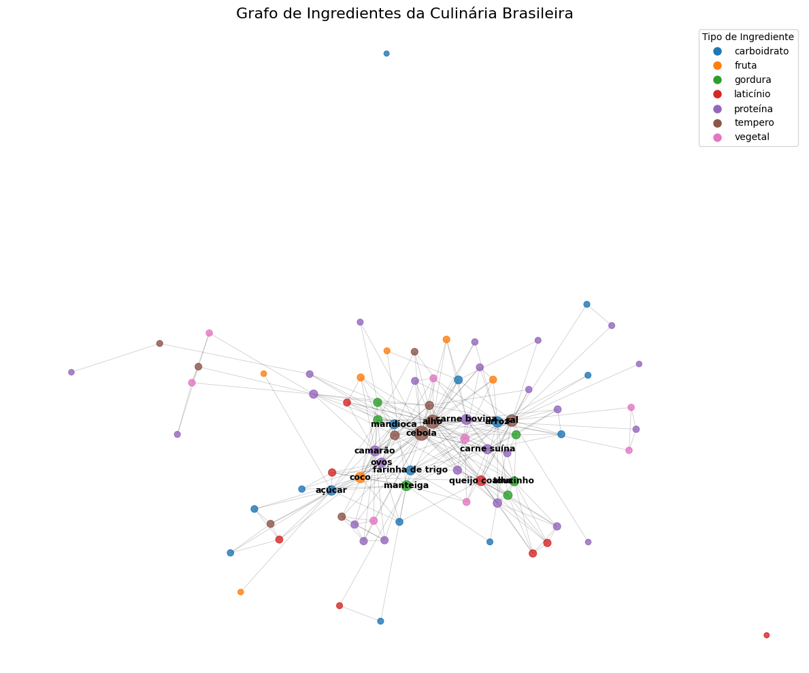

# Trabalho 02 – Análise de Assortatividade em Grafos de Ingredientes da Culinária Brasileira

**Nome:** Ian Antonio Fonseca Araújo
**Matrícula:** 00000000000
**Curso:** Engenharia de Computação

---

## 1. Descrição da Tarefa

Neste trabalho, construí um grafo de co-ocorrência de ingredientes a partir de 50 receitas tradicionais brasileiras retiradas do site [penaestrada.blog.br](https://www.penaestrada.blog.br/comidas-tipicas-do-brasil/).

Utilizei o modelo GPT-4 com a ferramenta de "Deep Research" para identificar e extrair automaticamente os ingredientes a partir de imagens das receitas e classificá-los em oito categorias: proteína, carboidrato, vegetal, fruta, laticínio, gordura, condimento e outro.

O GPT-4 gerou inicialmente os dados no formato JSON, mas com pequenos erros de codificação (unicode). Para corrigir esses detalhes, utilizei o modelo Gemini 2.5 Pro, aplicando prompts específicos para normalização dos caracteres acentuados.

Posteriormente, o JSON tratado foi utilizado para construir um grafo em Python com NetworkX e analisar a assortatividade por tipo de ingrediente.

**Vídeo de apresentação (até 5 min):** [Link do vídeo de demonstração](https://youtu.be/seu_link_aqui)

---

## 2. Organização do Repositório

- **README.md**: documento com instruções, principais achados e imagens.
- **ingredientes.json**: base de dados com 50 pratos e lista de ingredientes classificados por tipo.
- **Ingredientes.ipynb**: notebook contendo: leitura do JSON, construção do grafo, atribuição de tipo aos nós, cálculo do coeficiente de assortatividade e visualização do grafo.
- **llm\_info.md**: informações sobre os modelos de linguagem utilizados (GPT-4 e Gemini 2.5 Pro) e os prompts aplicados.
- **images/**: pasta com figuras geradas durante o trabalho.

---

## 3. Principais Achados (≤ 500 palavras)

A partir do grafo de co-ocorrência de ingredientes construído com 50 receitas tradicionais, medi o coeficiente de assortatividade ponderado por tipo usando a função `attribute_assortativity_coefficient(G, "tipo")` do NetworkX e obtive **-0,0524**.

O valor negativo, embora próximo de zero, indica uma leve tendência à **heterofilia**: ou seja, ingredientes de diferentes tipos tendem a aparecer juntos com mais frequência do que ingredientes do mesmo tipo. Isso é coerente com a diversidade da culinária brasileira, que frequentemente combina grupos distintos de ingredientes (por exemplo, proteínas como carne e carboidratos como arroz em um mesmo prato).

A análise visual do grafo confirma essa observação. Como pode ser visto, há uma maior conectividade entre nós de diferentes cores, representando ingredientes de categorias distintas. Temperos como sal, alho e cebola atuam como "pontes" entre diferentes tipos de ingredientes, conectando proteínas, vegetais e carboidratos. 

Essa leve heterofilia reforça a característica da gastronomia nacional: diversidade e complementaridade, misturando texturas, sabores e propriedades nutricionais diferentes em um mesmo prato. Em resumo, a análise mostra que a culinária brasileira prefere combinações contrastantes de ingredientes, potencializando o equilíbrio entre sabor e valor nutricional.

---

## 4. Visualização do Grafo

Abaixo, a visualização gerada com colorização por tipo de ingrediente:

