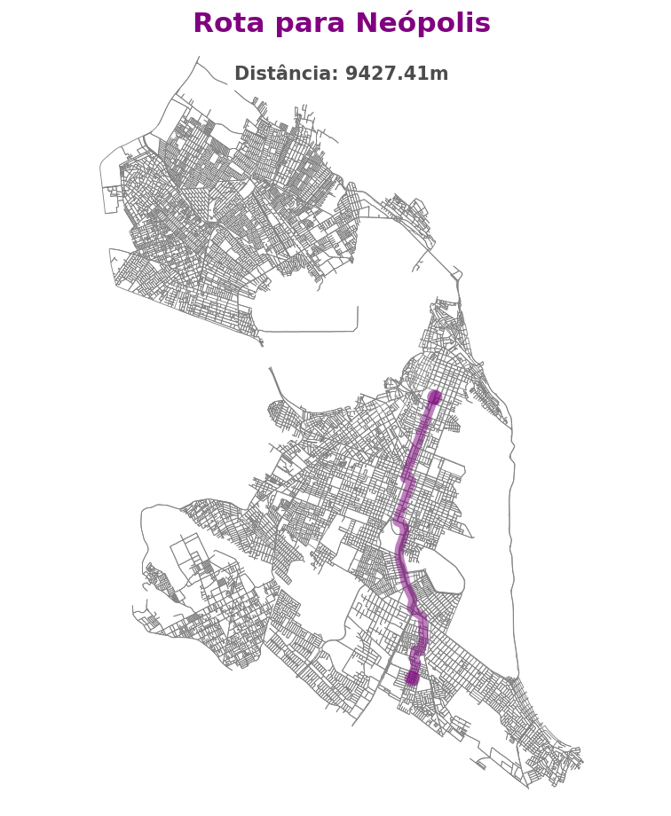
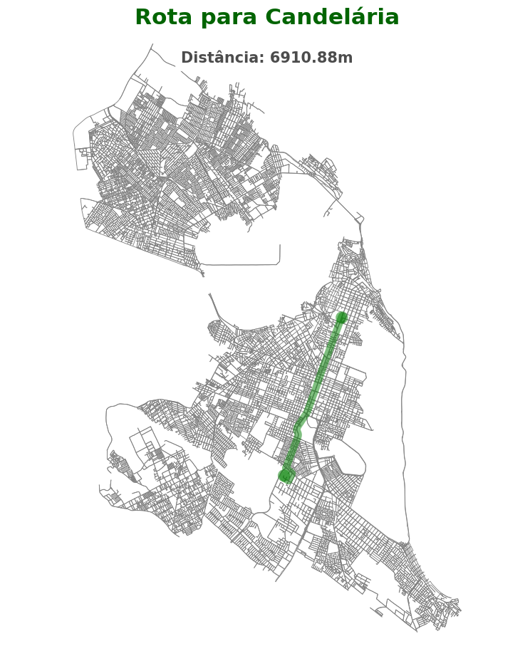
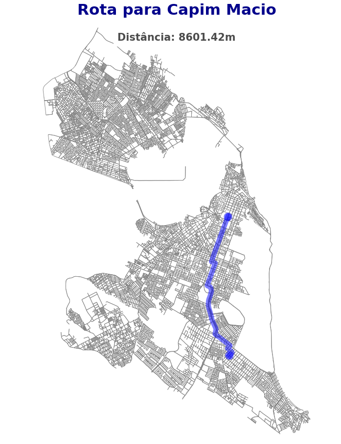
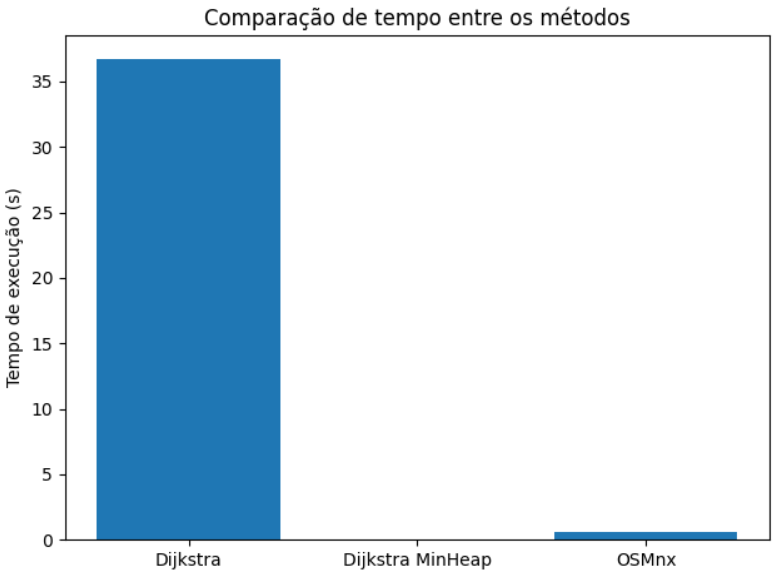
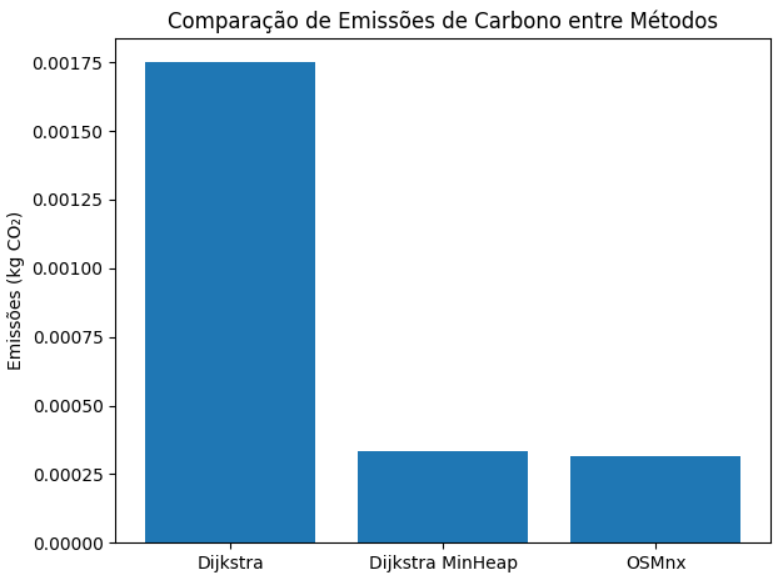

  

<strong>UNIVERSIDADE FEDERAL DO RIO GRANDE DO NORTE</strong>

 
DEPARTAMENTO DE ENGENHARIA DE COMPUTAÇÃO E AUTOMAÇÃO  
DCA3702 - ALGORITMOS E ESTRUTURAS DE DADOS II  

<h2 align="center"><strong>PROJETO 01</strong></h2>

**Discentes**: Ian Antonio Fonseca Araújo, Minnael Campelo de Oliveira  
**Docente**: Ivanovitch Medeiros Dantas da Silva  

**Natal/RN — 2025**

## 1. Problemática

Em centros urbanos, a eficiência na escolha de rotas para serviços de entrega é crucial para reduzir custos, economizar tempo e minimizar impactos ambientais. Este projeto visa avaliar o desempenho de diferentes algoritmos de menor caminho aplicados a um cenário realista de entrega por motoboys em Natal/RN.

O foco será comparar a performance de três algoritmos de menor caminho — a implementação do OSMnx, Dijkstra tradicional e Dijkstra com min-heap — considerando critérios como tempo de execução, semelhança nas rotas e pegada de carbono.

## 2. Desenvolvimento

O cenário escolhido para este projeto foi o de rotas de entrega realizadas por motoboys na cidade de Natal/RN. A simulação considera como ponto de partida a Avenida Prudente de Morais, uma das principais vias da cidade, em direção a três bairros distintos: Neópolis, Candelária e Capim Macio.

Para cada um desses três destinos, foram testadas rotas utilizando três algoritmos de menor caminho. O objetivo principal foi simular situações reais de entrega e verificar quais algoritmos conseguem gerar caminhos mais rápidos e eficientes, considerando o tempo de execução, a qualidade da rota e o impacto ambiental gerado pelo processamento computacional.

Para garantir uma comparação justa, cada algoritmo foi aplicado exatamente às mesmas três rotas (Prudente de Morais → Neópolis, Candelária e Capim Macio), totalizando nove simulações no conjunto do experimento. Dessa forma, foi possível analisar o comportamento dos algoritmos sob condições semelhantes.

Adicionalmente, foi criada uma API que retorna o caminho atualizado em função de sua posição em determinado tempo. O código-fonte e instruções para utilização estão disponíveis no seguinte repositório: [link]

## 3. Resultados

### Mapas das rotas geradas
Fazendo um comparativo geral e relacionando imagem a imagem geradas por meio das três versões do algortimo dijsktra (tradicional, min-heap, implementação osmnx) foi possível chegar a conclusão que não houve nenhum tipo de mudança no cálculo e na distância de um ponto A ou um ponto B.  

   
  
   
  
   
  

### Tempo de Execução dos Algoritmos  
Como era previsto, devido às diferenças nos níveis de complexidade computacional das implementações, seguindo a ordem crescente de eficiência Dijkstra convencional, com min-heap e via OSMnx é possível afirmar que os tempos de execução das versões com min-heap e com OSMnx tendem a ser significativamente inferiores ao da implementação convencional. Além disso, como ambas utilizam estruturas de dados otimizadas, como filas de prioridade (min-heaps), seus desempenhos em tempo de execução são bastante semelhantes, especialmente em grafos grandes e esparsos.

### Pegada de Carbono (em kgCO2eq)  
Do ponto de vista da eficiência energética e sustentabilidade computacional, as diferentes implementações do algoritmo de Dijkstra também apresentam variações em suas pegadas de carbono. A implementação convencional, por não utilizar estruturas otimizadas e exigir maior número de operações elementares, tende a consumir mais tempo de CPU e, consequentemente, mais energia elétrica, resultando em uma pegada de carbono mais elevada.

A versão com min-heap reduz significativamente o número de operações de busca e atualização, o que implica em menor tempo de execução e menor consumo energético. Já a implementação com OSMnx, embora envolva chamadas a bibliotecas externas e eventuais acessos à internet (por exemplo, para download de dados do OpenStreetMap), aproveita algoritmos otimizados internamente (via NetworkX) e reduz substancialmente o esforço computacional necessário para estruturar e resolver o grafo. Assim, seu impacto ambiental direto tende a ser semelhante ou até inferior ao da versão com min-heap, dependendo do contexto e da frequência de acesso aos dados externos.

Portanto, do ponto de vista da pegada de carbono, as implementações com min-heap e com OSMnx são mais sustentáveis, enquanto a versão convencional representa a alternativa menos eficiente do ponto de vista energético.

## 4. Conclusão

A avaliação mostrou que o algoritmo Dijkstra com minheap proporciona uma boa relação entre desempenho computacional e qualidade da rota. 

## Vídeo Explicativo

[Link para o vídeo no YouTube ou Loom](https://www.youtube.com/seuvideoaqui)
